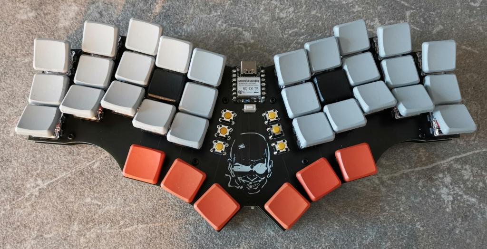

# uninarf

[More pictures here](https://imgur.com/a/TW84yVa)

## Attention

I'm a hobbyist/amateur at best. So there may be things that aren't optimized. For example
this board doesn't have a ground plane and some edges aren't rounded properly. That being said I've had the files
in the `gerbers/` directory manufactured at JLC with 1.6mm size and they work just fine with the code provided in the
at https://github.com/sebastian-stumpf/zmk-config-uninarf - So if you decide to use this, then please be advised that
I'm not providing any sort of liability and you should exercise some caution.

## BOM

| Quantity  | Item                               | Comment                                                                            |
| --------- | ---------------------------------- | ---------------------------------------------------------------------------------- |
| 1         | Seeed XIAO BLE                     |                                                                                    |
| 1         | 74HC595 SO-16 Shift Register       | I used 74HC 595D NXP                                                               |
| 42        | 1N4148 SOD123 diodes               |                                                                                    |
| 36        | Choc Hotswap Sockets               |                                                                                    |
| 6         | Omrom 6mm Tact switches            | B3F-1002                                                                           |
| 36        | Choc Switches + Keycaps            |                                                                                    |
| 8         | M2 Screws and Spacers              |                                                                                    |
| 1         | MSK12C02 power switch              |                                                                                    |
| 1         | 1 S2B-PH-K-S(LF)(SN) jack          |                                                                                    |
| 1         | 3.7v lipo battery                  | any size will do as long as it fits between the spacers. I've used a 500mAh 403040 |

## Feedback

I'm always happy to hear your opinions about this and if you decide to build this board then please do send me a picture of it.

## Thanks

Big thanks to [GEIST](https://github.com/GEIGEIGEIST) and his [TOTEM](https://github.com/GEIGEIGEIST/TOTEM) where I grabbed the 
xiao ble footprint from. It makes soldering the MCU a lot easier!
